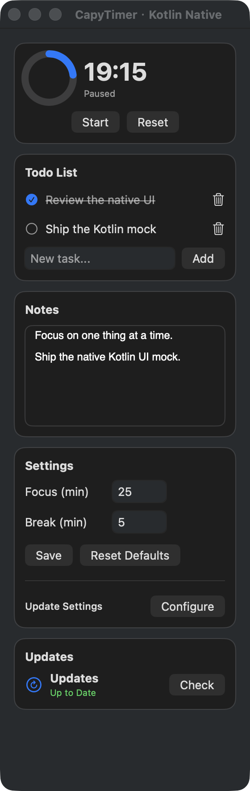
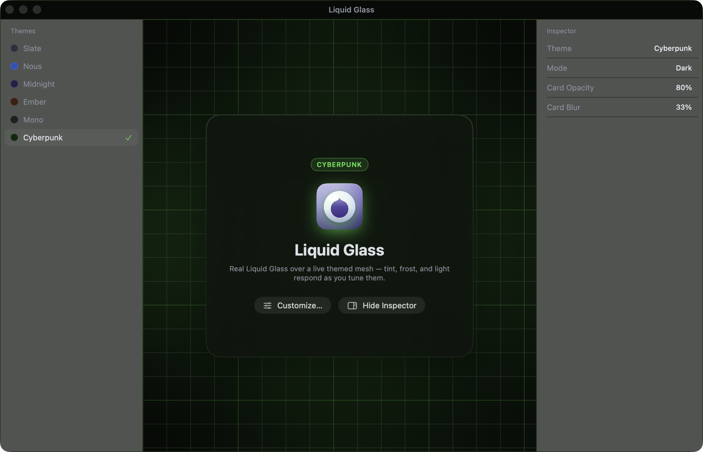

<div align="center">

# SwiftUI Kotlin Binding

**用 Kotlin 编写原生 SwiftUI 界面。**

使用 Compose 语法，由 Kotlin 管理状态，让 Apple 原生控件完成绘制。

[](https://kotlinlang.org/) [](https://www.jetbrains.com/compose-multiplatform/) [](#支持范围) [](LICENSE) [](docs/releasing.md)

[English](README.md) · **简体中文**

[快速开始](#快速开始) · [示例](#示例) · [工作原理](#工作原理) · [文档](#文档)

</div>

SwiftUI Kotlin Binding 让你通过 Kotlin Composable 编写 Apple 原生界面。Kotlin 负责布局、样式、状态和行为，生成的薄桥接层调用官方 SwiftUI API。Compose Runtime 管理组合与更新，SwiftUI 执行界面的原生测量和绘制。

## 示例

以下图片来自实际运行的 Kotlin/Native 应用。点击效果图即可进入对应示例目录。

<table>
<tr>
<th width="25%"><a href="samples/capytimer/">CapyTimer</a></th>
<th width="75%"><a href="samples/liquid-glass/">Liquid Glass</a></th>
</tr>
<tr>
<td valign="top"><a href="samples/capytimer/"></a><p>紧凑的专注面板，包含进度环、任务列表和可编辑笔记。</p></td>
<td valign="top"><a href="samples/liquid-glass/"></a><p>六种深色主题、网格渐变背景、磨砂卡片，以及用 Kotlin 路径和渐变声明的图标。</p><p>两个示例均使用本地 mock 数据和原生控件，各自目录保留了上游项目署名与 MIT 许可证。</p></td>
</tr>
</table>

## 为什么使用它？

- **原生绘制。** 文字、按钮、编辑器、布局容器与视觉效果直接调用官方 SwiftUI API。
- **Kotlin 决定界面。** 使用 `@Composable` 声明 UI，通过 `remember` 管理状态，在 Kotlin 中处理事件。
- **单一原生根宿主。** 整棵组合树由一个 `NSHostingView` 承载，状态变化更新已有节点。
- **有类型的生成式绑定。** 经核读的组件白名单和语义模型统一生成 C ABI、Swift 转发、Kotlin API 与 Composable。
- **按需更新。** 运行时响应状态变化调度组合工作，静止示例窗口已通过空闲调度和资源释放检查。

## 快速开始

### 运行示例

在 Apple Silicon Mac 上准备 Xcode 和 arm64 JDK 21，然后执行：

```sh
git clone https://github.com/zly2006/swiftui-kotlin-binding.git
cd swiftui-kotlin-binding
export JAVA_HOME="$(/usr/libexec/java_home -v 21 -a arm64)"
./gradlew :samples:liquid-glass:linkDebugExecutableMacosArm64
./samples/liquid-glass/build/bin/macosArm64/debugExecutable/LiquidGlassMock.kexe --dark
```

运行 CapyTimer 时，构建任务使用 `:samples:capytimer:linkDebugExecutableMacosArm64`，然后启动该示例构建目录中的 `CapyTimerMock.kexe`。

### 添加到 Kotlin 项目

Maven Central 发布已暂停。以下是为下一次发布准备的正确坐标，当前可先通过源码运行示例。

使用 Kotlin **2.4.0**、Kotlin Compose 编译器插件和 `macosArm64()` target。添加 Maven Central 与公共运行库依赖：

```kotlin
repositories { mavenCentral() }

kotlin {
    macosArm64()
    sourceSets.commonMain.dependencies {
        implementation("me.zly2006.swiftui:swiftui-compose:0.1.0")
    }
}
```

macOS 桥接模块和它包含的原生静态库会作为传递依赖解析。使用发布版时，无需自行生成绑定或复制 Swift 库。

### 编写界面

```kotlin
import androidx.compose.runtime.*
import me.zly2006.swiftui.nativeui.*

@Composable
fun Counter() {
    var count by remember { mutableStateOf(0) }
    Column(spacing = 12.0, modifier = NativeModifier.padding(24.0)) {
        Text("Count: $count", NativeModifier.semanticFont(TextStyle.Headline))
        Button(onClick = { count++ }) { Text("Increment") }
    }
}
```

通过 `MacosNativeUiBackend` 和 `NativeComposition` 把组合内容挂载到 macOS 窗口。完整的 [入门指南](docs/getting-started.md) 包含项目配置、窗口入口与生命周期清理。

## 工作原理

```text
Kotlin @Composable 与状态
          ↓
Compose Runtime → 增量更新原生节点
          ↓
生成的强类型 C ABI → Swift 薄层转发
          ↓
官方 SwiftUI → 单一原生窗口宿主
```

| 模块 | 职责 |
| --- | --- |
| [`swiftui-compose`](swiftui-compose/) | 公共 Kotlin Composable、Compose Runtime 接入、更新、回调与所有权管理。应用使用这一依赖。 |
| [`swiftui-bridge`](swiftui-bridge/) | 原生互操作、SwiftUI 宿主、资源管理与内嵌的 Swift 静态库。 |
| [`swiftui-codegen`](swiftui-codegen/) | 根据组件白名单和有类型语义模型，在构建期生成绑定；作为仓库工具，不发布到 Maven。 |
| [`samples`](samples/) | 独立 Kotlin UI 示例与 macOS 测试宿主。 |

Kotlin 选择界面结构及参数，Swift 转发官方 API 调用，不包含应用页面或业务状态。绘制路径使用 Compose Runtime，没有 Skia 绘制宿主。

## 支持范围

**0.1.0 是面向 macOS Apple Silicon 的早期版本。** 原生 API 以 macOS 15 及以上为目标。应用应使用 Kotlin 2.4.0 和兼容的 Apple 工具链构建；本版本在 macOS 26 与 Xcode 26 上完成验证。

JVM target 用于公共 API 编译和运行时测试，不提供 Apple UI 绘制。iOS、Intel macOS 和完整 SwiftUI 能力覆盖仍在规划中。原生绘制旨在保留平台的资源优势，CPU 与内存的等价应用对照尚待完成。

## 文档

- [入门指南](docs/getting-started.md)：添加发布版依赖并打开原生窗口。
- [架构边界](docs/architecture.md)：Kotlin、Swift 与模块的责任归属。
- [组件白名单](docs/component-whitelist.md)：已选择的能力与后续补充范围。
- [代码生成](docs/code-generation.md)：绑定的生成方式。
- [原生验证](docs/native-verification.md)：构建、生命周期和运行时证据。
- [发布流程](docs/releasing.md)：发布与独立消费项目检查。

欢迎补充 API、改进原生行为与完善文档。新增绑定应遵循 [项目约束](AGENTS.md)，修改后运行生成器和 Compose 接入测试：

```sh
./gradlew :swiftui-codegen:test :swiftui-compose:jvmTest
```

## 许可证

库采用 **GPL-3.0-only**，完整条款见 [LICENSE](LICENSE)。CapyTimer 和 Liquid Glass 的改写示例在各自目录中保留上游 MIT 许可证与署名。
